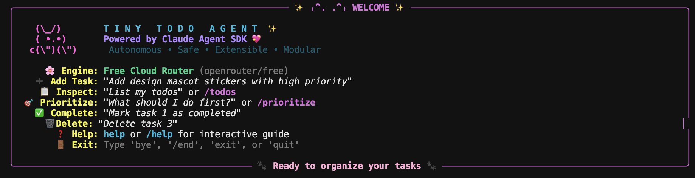
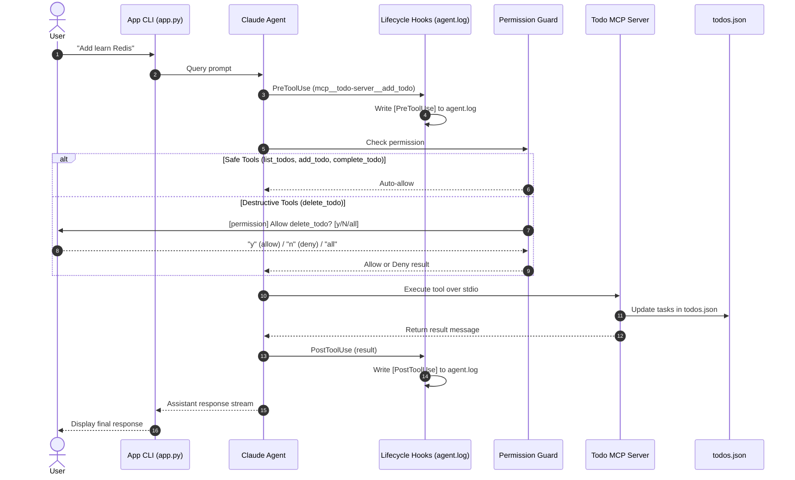

# 🌸 Tiny Todo Agent ✨

> **A charming, autonomous task companion built with the Claude Agent SDK & Model Context Protocol (MCP)**



---

## 🎀 About the Project

**Tiny Todo Agent** is a friendly terminal companion designed to make task management effortless and fun. Built on the **Claude Agent SDK** and **Model Context Protocol (MCP)**, it goes far beyond a simple CLI script. It understands your priorities, delegates complex planning to dedicated subagents, runs tools safely in isolated processes, and keeps you informed through an aesthetic, color-rich terminal interface.

---

## 🚀 Getting Started

### 1. Install Dependencies
```bash
uv sync
```

### 2. Configure Your Key
Copy the template and set either your Anthropic or OpenRouter key in `.env`:
```bash
cp .env.example .env
```
```env
# Official Anthropic API
ANTHROPIC_API_KEY=sk-ant-...

# Or OpenRouter Free Tier
# OPENROUTER_API_KEY=sk-or-...
```

### 3. Run
```bash
uv run python app.py
```
*To resume a previous session: `uv run python app.py --resume`*

---

## 💬 Commands & Prompts

| Prompt / Command | Action | Confirmation? |
| :--- | :--- | :--- |
| `"Add design mascot stickers [high]"` | Creates a new high-priority task | No (Auto-approved) |
| `"List my todos"` or `/todos` | Displays active task backlog table | No (Auto-approved) |
| `"What should I do first?"` or `/prioritize` | Asks prioritizer subagent for recommendations | No (Auto-approved) |
| `"Mark task 1 as done"` | Updates task status to completed | No (Auto-approved) |
| `"Delete task 2"` | Permanently removes task from disk | Yes (`[y/N/all]`) |
| `help` or `/help` | Shows offline command cheat sheet | No |
| `bye`, `/end`, `exit` | Saves tasks and closes session | No |

---

## 🌟 Key Features

- 🐾 **Delightful Terminal UI:** Styled with `rich`, featuring our bunny mascot, visual inspection cards for tool calls (`⚙️`) and subagents (`🧠`), and clean task tables with color-coded priority badges and strikethroughs for finished items.
- ⚙️ **Decoupled MCP Architecture:** Runs a dedicated stdio MCP server (`todo-server`) so disk storage (`todos.json`) remains completely independent from AI reasoning.
- 🧠 **Smart Subagent Delegation:** Hands off task prioritization to a specialized `prioritizer` subagent. It has read-only access to inspect your backlog and recommend what to tackle next.
- 🛡️ **Smooth, Sensible Safety:**
  - **Auto-approved:** Safe actions like listing tasks (`list_todos`), creating new ones (`add_todo`), and marking items done (`complete_todo`) run immediately without nagging prompts.
  - **Guarded:** Only permanent deletions (`delete_todo`) ask for confirmation. It understands natural replies (`yep`, `sure`, `ok`) and lets you type **`all`** to approve batch deletions at once.
- 📚 **Skills & Quick Shortcuts:** Comes with project skills (`todo-management`), fast slash commands (`/todos`, `/prioritize`), and an instant offline guide (`help`).
- 🔄 **Seamless Session Resumption:** Automatically tracks conversation state so you can close your terminal anytime and resume right where you left off using `--resume`.
- 🔍 **Audit Logging:** Records every tool call and result with UTC timestamps in `agent.log` for complete transparency.

---

## 🔄 How It Works (Execution Flow)

Every request passes through the agent lifecycle, permission guards, and the MCP server before updating disk storage:



---

## 🏗️ Project Architecture

```text
tiny-todo-agent/
├── agent/
│   ├── agent.py         # Main agent loop, SDK client, and session handling
│   ├── ui.py            # Rich TUI: mascot art, step cards, and tables
│   ├── permissions.py   # Security guards: auto-allows safe actions & handles [y/N/all]
│   ├── subagents.py     # Prioritizer subagent definition (read-only scope)
│   ├── hooks.py         # PreToolUse & PostToolUse lifecycle audit logging
│   ├── proxy.py         # Cloud model API connector
│   └── storage.py       # Pure disk I/O and task mutations
├── app.py               # Ultra-thin entrypoint
├── mcp_server.py        # Standalone stdio MCP server (todo-server)
├── todos.json           # JSON database storing your tasks
├── AGENTS.md            # Guidelines, memory rules, and tool contracts
└── CLAUDE.md            # Project memory routing directive
```

---

<div align="center">
  <sub>🐾 Built with Claude Agent SDK • Model Context Protocol • Rich 🐾</sub>
</div>
