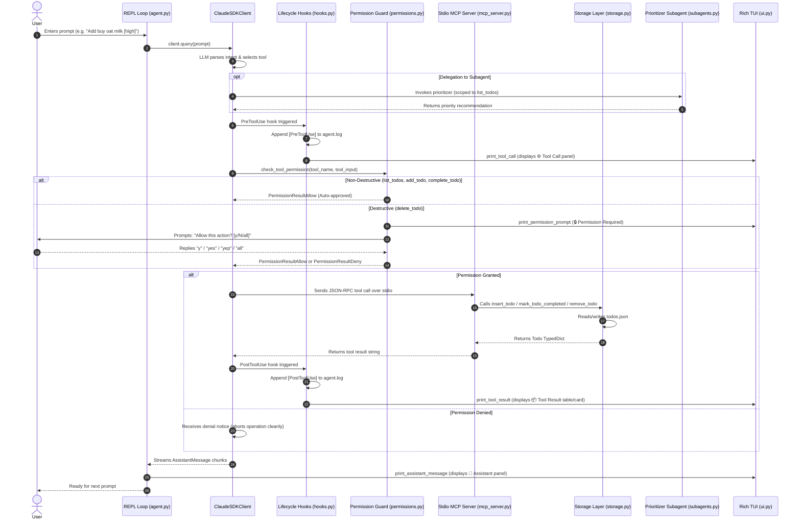

# 📖 Tiny Todo Agent — Complete Architecture & Workflow Guide

An end-to-end explanation of how the **Tiny Todo Agent** works, written in straightforward language while using official terminology from the **Claude Agent SDK**, the **Model Context Protocol (MCP)**, and the **Rich TUI** library.

---

## 1. High-Level Concept in Simple Terms

At its core, Tiny Todo Agent is an **autonomous task assistant**. Unlike an ordinary CLI script that simply runs hardcoded commands (like `if cmd == "add"`), this project runs an **AI Agent**:
1. You talk to it in plain English (*"Add buy oat milk with high priority"* or *"What should I do first?"*).
2. The **Claude Agent SDK** orchestrates the reasoning loop. It decides *when* and *which* tools to call.
3. Actions that inspect or modify tasks are decoupled into a dedicated **Model Context Protocol (MCP) Server**.
4. Dangerous actions (permanent deletions) are intercepted by a **Permission Guard** before they can touch your disk.
5. Complex decisions (task prioritization) are delegated to a specialized **Subagent**.
6. Every internal event (tool calls, arguments, outputs, subagent decisions) is rendered transparently on your screen using a custom **Rich Terminal UI (TUI)** and audited in a log file.

---

## 2. The Complete Life of a Prompt (Step-by-Step)

Here is exactly what happens behind the scenes from the moment you press Enter until the final response appears:

---

## 3. What Was Added: Component & Module Breakdown

The codebase is organized into modular Python files, each handling a single responsibility:

### 1. The Entry Point: [`app.py`](file:///Users/anusha/code/vsc/tiny-todo-agent/app.py)
- **Official Role:** CLI Entry Point.
- **What it does:** Kept ultra-thin (13 lines). It checks for the `--resume` command-line argument and hands off control to `asyncio.run(run_cli(resume=resume))`.

---

### 2. Main Agent Loop: [`agent/agent.py`](file:///Users/anusha/code/vsc/tiny-todo-agent/agent/agent.py)
- **Official Role:** SDK Client & Agent Orchestrator.
- **Key Functions:**
  - `build_agent_options(...)`: Constructs the official **`ClaudeAgentOptions`** instance. This passes in:
    - `model`: Selected model identifier.
    - `system_prompt`: Core instructions guiding Claude to act directly without overthinking.
    - `mcp_servers`: Connects the external stdio MCP server (`{"todo-server": {"type": "stdio", ...}}`).
    - `can_use_tool`: Injects our custom permission callback (`check_tool_permission`).
    - `hooks`: Registers lifecycle hook matchers (`PreToolUse`, `PostToolUse`).
    - `agents`: Registers specialized subagents (`prioritizer`).
    - `setting_sources=["project"]`: Tells the SDK to load project-level skills and commands from `.claude/`.
  - `run_cli(resume: bool)`: An asynchronous REPL loop using **`ClaudeSDKClient`**. It prints the welcome mascot banner, reads user input, handles slash commands, runs `await client.query(prompt)`, and streams responses.
  - `_is_exit_command(text)`: Detects natural farewell keywords (`bye`, `goodbye`, `/end`, `exit`, `quit`).
  - `_save_session_id(sid)` & `_load_session_id()`: Handles session state persistence to `.session_id`.

---

### 3. Dedicated MCP Stdio Server: [`mcp_server.py`](file:///Users/anusha/code/vsc/tiny-todo-agent/mcp_server.py)
- **Official Role:** Standalone Model Context Protocol (MCP 2.x) Server.
- **What it does:** Runs as an independent process via `MCPServer("todo-server")`. It exposes the four core tools:
  - `@server.tool(name="list_todos")`: Queries tasks from `todos.json` (filtered by `status="all" | "pending" | "completed"`).
  - `@server.tool(name="add_todo")`: Inserts a new task with `title` and `priority="low" | "medium" | "high"`.
  - `@server.tool(name="complete_todo")`: Marks an existing task as completed by integer `id`.
  - `@server.tool(name="delete_todo")`: Permanently deletes a task by integer `id`.
- **Why this matters:** The LLM never touches `todos.json` directly. It must invoke standard JSON-RPC protocol calls to this external MCP server.

---

### 4. Storage & Persistence Layer: [`agent/storage.py`](file:///Users/anusha/code/vsc/tiny-todo-agent/agent/storage.py)
- **Official Role:** Pure Disk I/O & Data Modeling.
- **Key Types & Functions:**
  - `Todo` (`TypedDict`): Enforces type safety for task objects: `id` (int), `title` (str), `status` (pending/completed), `priority` (low/medium/high), and `created_at` (ISO timestamp).
  - `load_todos()` & `save_todos(data)`: Atomically reads and writes to `todos.json`.
  - `insert_todo(title, priority)`: Auto-increments task IDs and appends new items.
  - `get_todos(status)`: Filters tasks by status.
  - `mark_todo_completed(todo_id)`: Updates status in place.
  - `remove_todo(todo_id)`: Deletes task by ID.

---

### 5. Security & Safety Guard: [`agent/permissions.py`](file:///Users/anusha/code/vsc/tiny-todo-agent/agent/permissions.py)
- **Official Role:** SDK `can_use_tool` Authorization Callback.
- **Key Types & Functions:**
  - `check_tool_permission(tool_name, tool_input, context)`: Intercepts every tool call before execution:
    - **Safe Bypass:** If tool is `list_todos`, `add_todo`, or `complete_todo`, it returns **`PermissionResultAllow()`** immediately with zero user interruption.
    - **Destructive Guard:** If tool is `delete_todo`, it renders a styled warning card (`print_permission_prompt`) and prompts: `❓ Allow this action? [y/N/all]: `.
    - **Conversational Affirmations:** Accepts `y`, `yes`, `yep`, `yeah`, `sure`, `ok`, `okay`, `s`, or `1`.
    - **Batch Approval:** If the user types `all` or `a`, it sets `_batch_approved = True` to auto-approve all subsequent deletions in the same turn without asking repeatedly.
    - **Denial Guard:** If the user denies, it returns **`PermissionResultDeny`** with an explicit message: *"User declined permission to delete_todo. Do not retry this action."*
  - `reset_turn_permissions()`: Clears the batch approval flag at the start of every new user turn.

---

### 6. Lifecycle Observability & Audit Logging: [`agent/hooks.py`](file:///Users/anusha/code/vsc/tiny-todo-agent/agent/hooks.py)
- **Official Role:** SDK Lifecycle Event Handlers (`HookMatcher`).
- **Key Functions:**
  - `pre_tool_hook(hook_input, tool_use_id, context)`: Triggers right before any tool runs. Writes `[PreToolUse] <tool> <args>` to `agent.log` and displays the `⚙️ Tool Call` card in the terminal.
  - `post_tool_hook(hook_input, tool_use_id, context)`: Triggers right after a tool completes. Writes `[PostToolUse] <tool> -> <response>` to `agent.log` and displays the `📦 Tool Result` card in the terminal.
  - `get_agent_hooks()`: Returns a dictionary of `HookMatcher` objects wired into `ClaudeAgentOptions(hooks=...)`.

---

### 7. Multi-Agent Delegation: [`agent/subagents.py`](file:///Users/anusha/code/vsc/tiny-todo-agent/agent/subagents.py)
- **Official Role:** Subagent Declarations (`AgentDefinition`).
- **Key Functions:**
  - `get_agent_definitions()`: Declares the specialized **`prioritizer`** subagent:
    - **Scoped Tool Access:** Strictly restricted to `tools=["mcp__todo-server__list_todos"]`. It cannot add, modify, or delete tasks.
    - **System Prompt:** Instructed to evaluate tasks by priority (`high` > `medium` > `low`) and urgency, returning a single concise recommendation with reasoning.
    - **Memory:** Scoped with `memory="project"`.

---

### 8. Aesthetic Terminal UI: [`agent/ui.py`](file:///Users/anusha/code/vsc/tiny-todo-agent/agent/ui.py)
- **Official Role:** Rich Terminal Presentation Layer.
- **Key Functions:**
  - `print_banner()`: Renders the welcome panel with the ASCII bunny mascot (`(\_/) ( •.•) c(")(")`), active model engine, session ID, and sample prompt hints.
  - `print_tool_call(tool_name, tool_input)`: Renders clean input parameter panels with color-coded key-value pairs instead of raw JSON dumps.
  - `print_tool_result(tool_name, response)`:
    - Uses `_unwrap_tool_response(response)` to peel off nested JSON strings.
    - Renders `list_todos` into a Rich `Table` with ID badges (`#1`), status icons (`⏳ Pending`, `✅ Done`), priority indicators (`🔴 High`, `🟡 Medium`, `🔵 Low`), and strikethroughs for completed tasks.
    - Renders `add_todo`, `complete_todo`, and `delete_todo` into concise status cards (`✨ Status:`, `✅ Status:`, `🗑️ Status:`).
  - `print_permission_prompt(tool_name, tool_input)`: Renders high-visibility security warning boxes.
  - `print_assistant_message(content)`: Formats assistant responses in rounded hot-pink panels using Rich Markdown.
  - `print_farewell()` & `print_help()`: Displays clean departure cards and instant command cheat sheets.

---

### 9. Project Knowledge, Skills, and Plugins
- **[`.claude/skills/todo-management/SKILL.md`](file:///Users/anusha/code/vsc/tiny-todo-agent/.claude/skills/todo-management/SKILL.md):** Markdown skill file with YAML frontmatter teaching the agent task guidelines and priority rules.
- **[`.claude/commands/todos.md`](file:///Users/anusha/code/vsc/tiny-todo-agent/.claude/commands/todos.md) & [`prioritize.md`](file:///Users/anusha/code/vsc/tiny-todo-agent/.claude/commands/prioritize.md):** Slash command shortcuts for `/todos` and `/prioritize`.
- **[`todo-plugin/`](file:///Users/anusha/code/vsc/tiny-todo-agent/todo-plugin/):** Self-contained plugin bundle containing `.claude-plugin/plugin.json`, packaged skills, commands, and subagents.
- **[`AGENTS.md`](file:///Users/anusha/code/vsc/tiny-todo-agent/AGENTS.md):** The single source of truth for agent behavior, tool schemas, and safety rules.
- **[`CLAUDE.md`](file:///Users/anusha/code/vsc/tiny-todo-agent/CLAUDE.md):** Direct `@AGENTS.md` inclusion directive for seamless memory routing.

---

## 4. Master Inventory: Tools, Functions, & Concepts

| Official SDK / MCP Concept | Project File | Key Function / Object | What It Does |
| :--- | :--- | :--- | :--- |
| **Agent Options Builder** | `agent/agent.py` | `build_agent_options()` | Configures model, prompt, MCP servers, hooks, permissions, and subagents. |
| **SDK Interactive Client** | `agent/agent.py` | `ClaudeSDKClient` | Opens async session, sends queries, streams responses, captures session IDs. |
| **REPL Loop** | `agent/agent.py` | `run_cli()` | Terminal prompt loop handling user input, exits, and help commands. |
| **MCP Stdio Server** | `mcp_server.py` | `MCPServer("todo-server")` | Out-of-process JSON-RPC server exposing task CRUD tools over stdio. |
| **MCP Tool: List** | `mcp_server.py` | `@server.tool list_todos` | Reads tasks from disk with optional status filter (`pending`/`completed`/`all`). |
| **MCP Tool: Add** | `mcp_server.py` | `@server.tool add_todo` | Inserts new task with title and low/medium/high priority. |
| **MCP Tool: Complete** | `mcp_server.py` | `@server.tool complete_todo` | Marks task as completed by numeric ID. |
| **MCP Tool: Delete** | `mcp_server.py` | `@server.tool delete_todo` | Permanently deletes task by ID (triggers security prompt). |
| **Disk State Mutation** | `agent/storage.py` | `load_todos()`, `save_todos()` | Atomic file read/write operations on `todos.json`. |
| **Typed Data Model** | `agent/storage.py` | `class Todo(TypedDict)` | Enforces schema: `id`, `title`, `status`, `priority`, `created_at`. |
| **Permission Hook** | `agent/permissions.py` | `check_tool_permission()` | Auto-approves safe actions; prompts confirmation for deletions (`[y/N/all]`). |
| **Batch Permission State**| `agent/permissions.py` | `_batch_approved`, `reset_turn_permissions()` | Auto-approves remaining operations when user types `all` or `a`. |
| **Pre-Tool Lifecycle Hook**| `agent/hooks.py` | `pre_tool_hook()` | Logs tool invocation to `agent.log` and triggers UI call card. |
| **Post-Tool Lifecycle Hook**| `agent/hooks.py`| `post_tool_hook()` | Logs tool return value to `agent.log` and triggers UI result card. |
| **Hook Registration** | `agent/hooks.py` | `get_agent_hooks()` | Binds `PreToolUse` and `PostToolUse` matchers for SDK dispatch. |
| **Subagent Definition** | `agent/subagents.py`| `prioritizer` (`AgentDefinition`)| Read-only subagent evaluating priorities with scoped tool access. |
| **Rich Presentation** | `agent/ui.py` | `print_tool_result()`, `print_banner()` | Renders cute ASCII mascot, formatted tables, and styled cards. |
| **Response Unwrapper** | `agent/ui.py` | `_unwrap_tool_response()` | Recursively unrolls nested stringified JSON into clean Python objects. |
| **Project Knowledge** | `.claude/skills/` | `SKILL.md` | Provides domain knowledge on task lifecycle and priority conventions. |
| **Project Commands** | `.claude/commands/` | `todos.md`, `prioritize.md` | Slash command prompt templates for quick actions. |
| **Session Resumption** | `app.py`, `agent/agent.py` | `--resume`, `.session_id` | Restores conversation context across restarts. |
| **Plugin Bundle** | `todo-plugin/` | `plugin.json` | Distributable bundle package mounting skills, commands, and subagents. |

---

  🐾 Tiny Todo Agent • Built with Claude Agent SDK & Model Context Protocol 🐾

