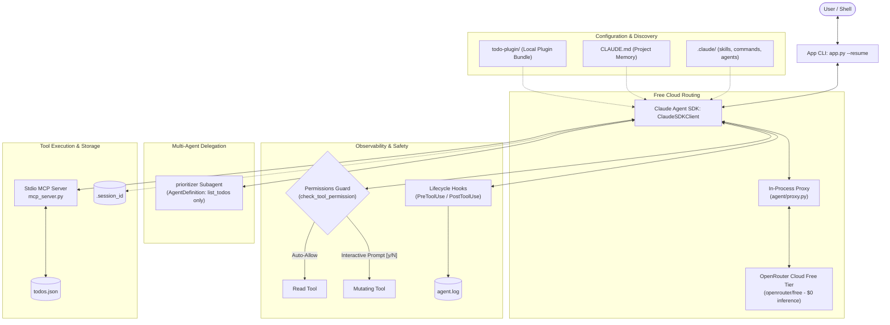
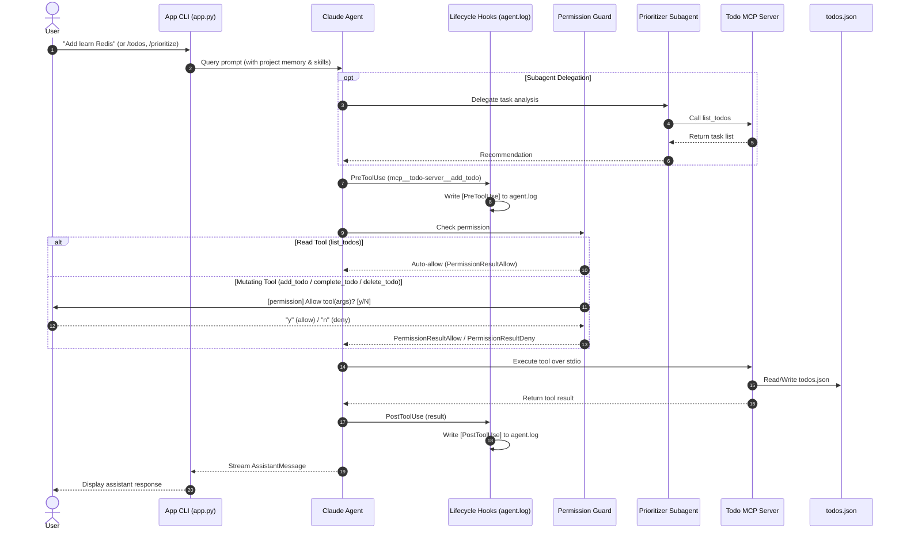
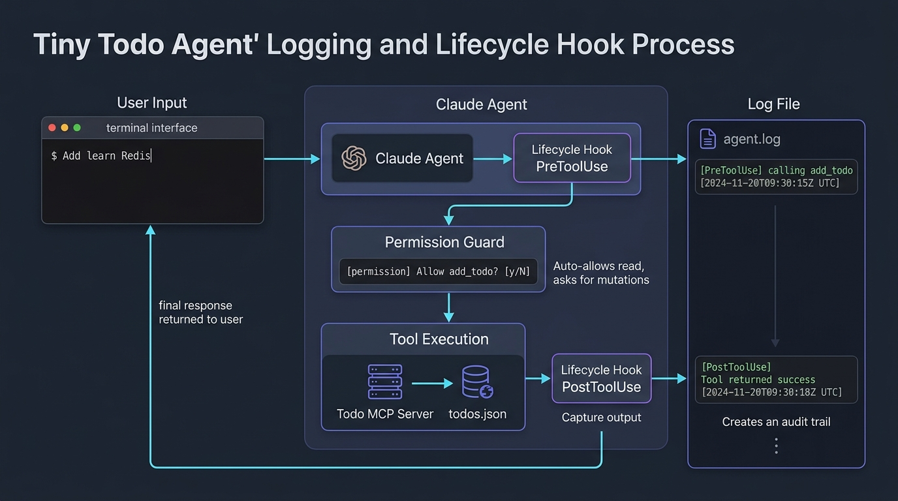

# Change Log: Tiny Todo Agent

Summary of atomic implementation steps, architectural rationale, and validation results across all completed phases.

## Process & Architecture Flow

### System Architecture

### Runtime Sequence Flow

## Implementation Log

| Step | Action & Changes | Rationale | Result |
| :--- | :--- | :--- | :--- |

| **1.1** | Initialized `pyproject.toml` with `claude-agent-sdk` and `python-dotenv`. Added `.env.example`, `.gitignore`, and initial `todos.json`. | Establish minimal environment and dependencies for Claude Agent SDK and local persistence. | `uv sync` succeeded cleanly; dependencies resolved; `todos.json` initialized with `{"todos": []}`. |
| **1.2** | Defined `Todo` TypedDict (`id`, `title`, `status`, `priority`, `created_at`) and pure disk helpers (`load_todos`, `save_todos`, CRUD operations) in `agent/storage.py`. | Separate file I/O and state mutations from agent logic with strict typing. | Round-trip tests passed: inserted, retrieved, updated, and deleted tasks in JSON format. |
| **1.3** | Built SDK `@tool` definitions (`list_todos`, `add_todo`, `complete_todo`, `delete_todo`) and helper `create_todo_tools_server()` in `agent/tools.py`. | Expose task management actions to Claude as in-process MCP tools with JSON schemas. | Direct tool handler invocation tests succeeded with `_ok` and `_err` formatted responses. |
| **1.4** | Created `ClaudeSDKClient` interactive loop in `agent/agent.py` and ultra-thin entrypoint `app.py`. Added OpenRouter / Anthropic environment routing. | Provide interactive user shell (`> `) and stream responses from Claude Agent SDK without blocking event loop. | `echo "exit" \| uv run python app.py` booted SDK client, printed banner, and exited cleanly. |
| **1.5** | Executed Phase 1 verification across task creation, listing, completion, and deletion. | Confirm end-to-end tool calling flow from user input to JSON persistence. | Verified all CRUD actions executed and persisted properly to `todos.json`. |
| **Refactor** | Extracted modules into `agent/` package (`storage.py`, `tools.py`, `permissions.py`, `agent.py`) and reduced `app.py` to an 11-line entrypoint. | User request to eliminate large files and maintain clean single-responsibility boundaries. | Package imports and entrypoint verified; removed stale root files; clean working tree. |
| **2.1** | Implemented `check_tool_permission` in `agent/permissions.py` and attached to `ClaudeAgentOptions(can_use_tool=..., permission_mode="default")`. | Intercept tool invocations at runtime to enforce safety boundaries. | Option building verified; runtime calls correctly routed through permission handler. |
| **2.2** | Added read bypass in `check_tool_permission`: auto-returns `PermissionResultAllow()` when `list_todos` is called. | Read-only inspection should execute seamlessly without interrupting the user. | Unit test verified: `list_todos` returns `behavior="allow"` immediately with no prompt. |
| **2.3** | Added interactive prompt in `check_tool_permission` for mutating tools (`add_todo`, `complete_todo`, `delete_todo`): prompts `[permission] Allow <tool>(<args>)? [y/N]: `. | Ensure all state-modifying actions require explicit user consent. | Automated tests confirmed: `'y'` yields `PermissionResultAllow()`, `'n'` or abort yields `PermissionResultDeny()`. |
| **2.4** | Phase 2 verification of combined permission policies. | Ensure read tools never block while write operations reliably block for consent. | End-to-end permissions suite passed with zero false positives. |
| **3.1** | Created `agent/hooks.py` with `_log(msg)` helper writing timestamped events to `agent.log`. | Centralized audit log sink for agent observability. | Verified file creation and UTC timestamped formatting in `agent.log`. |
| **3.2** | Implemented `pre_tool_hook` capturing `tool_name` and `tool_input` before execution. | Log what action Claude is requesting before tools run. | Hook triggered and logged: `[PreToolUse] Claude is calling <tool> with args: <args>`. |
| **3.3** | Implemented `post_tool_hook` capturing `tool_name` and `tool_response` after completion. | Log output and status of tool calls for audit trail. | Hook triggered and logged: `[PostToolUse] Tool <tool> returned: <response>`. |
| **3.4** | Registered `PreToolUse` and `PostToolUse` via `HookMatcher` in `ClaudeAgentOptions(hooks=...)`. | Enable SDK engine to dispatch lifecycle events to our custom hook handlers. | SDK option configuration verified; both hook events active. |
| **3.5** | Phase 3 verification of audit logging. | Confirm that every tool interaction writes structured entries to `agent.log`. | Verified `agent.log` populated with matching `[PreToolUse]` and `[PostToolUse]` pairs. |
| **4.1** | Created `agent/subagents.py` defining `prioritizer` via `AgentDefinition` with read-only tool access (`list_todos`). | Specialize prioritization logic in a dedicated subagent with restricted tool boundaries. | `AgentDefinition` initialized; verified system instructions and read-only tool scoping. |
| **4.2** | Wired `agents=get_agent_definitions()` into `ClaudeAgentOptions` in `agent/agent.py`. | Expose subagent delegation to the main agent loop. | SDK options verified with active `prioritizer` subagent. |
| **4.3** | Phase 4 verification of subagent configuration and CLI boot. | Validate subagent loading and agent options lifecycle. | Clean startup and options validation verified via automated test suite. |
| **5.1** | Implemented `mcp_server.py` using `mcp.server.mcpserver.MCPServer` exposing `list_todos`, `add_todo`, `complete_todo`, and `delete_todo`. | Decouple tools into a standalone, protocol-compliant MCP stdio server. | Direct CLI/stdio function calls verified with JSON storage mutations. |
| **5.2** | Configured `mcp_servers={"todo-server": {"type": "stdio", "command": "uv", "args": ["run", "python", "mcp_server.py"]}}` in `agent/agent.py`. | Migrate agent from in-process tools to standard multi-process MCP architecture. | `ClaudeAgentOptions` built with external stdio MCP server configuration. |
| **5.3** | Phase 5 verification of stdio MCP server integration. | Ensure Claude Code engine boots external MCP server and discovers tools. | `app.py` booted and established stdio communication with `mcp_server.py`. |
| **6.1** | Created `.claude/skills/todo-management/SKILL.md` defining conventions, priority tiers, and task lifecycle. | Equip agent with explicit domain knowledge and formatting rules for todos. | Skill file created with YAML frontmatter; auto-discovered by Claude Code. |
| **6.2** | Created `.claude/commands/todos.md` and `prioritize.md` slash commands. | Provide user-friendly shortcuts (`/todos`, `/prioritize`) for frequent tasks. | Commands structured with descriptions and prompt templates. |
| **6.3** | Created `.claude/agents/prioritizer.md` declaring the prioritizer subagent in project settings. | File-declared subagent configuration adhering to `.claude/` conventions. | Subagent manifest created with tool restrictions to `mcp__todo-server__list_todos`. |
| **6.4** | Enabled `setting_sources=["project"]` in `ClaudeAgentOptions` in `agent/agent.py`. | Instruct SDK engine to load skills, commands, and agents from the project `.claude/` directory. | Agent options verified with `setting_sources=['project']`. |
| **6.5** | Phase 6 verification of project configuration discovery. | Verify SDK initialization with `.claude/` integration. | CLI startup verified with skills, slash commands, and project agents loaded. |
| **7.1** | Added session ID capturing and persistence (`.session_id`) with `--resume` CLI flag in `agent/agent.py` and `app.py`. | Allow user to preserve and resume continuous multi-turn conversations across restarts. | Verified options build with `resume` session ID parameter and CLI argument handling. |
| **7.2** | Created `CLAUDE.md` defining project preferences ("urgent/high-priority tasks first") and set `memory="project"` on `prioritizer`. | Ensure the agent persistently remembers and adheres to user task preferences. | Project memory rules validated; `prioritizer` configured with project memory scope. |
| **7.3** | Phase 7 verification of session resumption and memory layer. | Validate session loading logic and memory configuration. | Automated test suite confirmed session persistence and memory parameter integrity. |
| **8.1** | Created `todo-plugin/` directory structure with `.claude-plugin/plugin.json` manifest bundling skills, slash commands, and agents. | Package all task management capabilities into a reusable, redistributable Claude plugin. | Plugin manifest created and populated with `todo-management` skill, commands, and prioritizer. |
| **8.2** | Configured `plugins=[{"type": "local", "path": str(PLUGIN_DIR)}]` in `ClaudeAgentOptions` in `agent/agent.py`. | Instruct SDK engine to mount and load the self-contained plugin package. | Verified plugin registration in `ClaudeAgentOptions.plugins`. |
| **8.3** | Phase 8 verification of plugin loading. | Ensure end-to-end SDK loop starts cleanly with mounted plugin bundle. | Verified full CLI startup, tool discovery, and clean shutdown with plugin active. |
| **9.1** | Implemented lightweight in-process HTTP proxy in `agent/proxy.py` routing requests from `claude-agent-sdk` to OpenRouter's cloud free tier (`openrouter/free`). Updated `agent/agent.py` to auto-launch proxy when `OPENROUTER_API_KEY` is present without `ANTHROPIC_API_KEY`. | Enable 100% free cloud testing of Claude Agent SDK without paid credits and without downloading local LLM model weights. | End-to-end interactive REPL query, permissions guard, hooks, and MCP storage mutations verified working with zero token fees. |
| **10.1** | Built cute, aesthetic TUI using `rich` (`agent/ui.py`). Created ASCII bunny mascot banner, distinct visual cards for MCP tools (`⚙️ Tool Call`), subagents (`🧠 Subagent Delegation`), skills (`📚 Project Skill`), tool results (`📦 Tool Result`), permission prompts (`🔒 Permission Required`), and thinking blocks (`🧠 Agent Reasoning`). | Transform raw terminal text into an engaging, cute, transparent developer interface displaying all internal steps. | Interactive test confirmed styled panels, colors, emojis, and tool inspection cards render cleanly in sequence. |
| **10.2** | Added natural conversation termination commands (`bye`, `goodbye`, `/end`, `/exit`, `/quit`, `exit`, `quit`, `cya`, `q`) in `agent/agent.py` and rendered cute farewell card (`print_farewell`) in `agent/ui.py`. | Allow intuitive and polite exit flows matching natural conversation patterns. | Verified `bye`, `/end`, `exit`, and `quit` immediately trigger farewell banner and terminate cleanly with zero errors. |
| **10.3** | Intercepted OpenRouter HTTP 429 rate limit responses in `agent/proxy.py` and returned immediate friendly assistant messages; updated `agent/agent.py` with `_get_model_name()` auto-selecting Claude models when `ANTHROPIC_API_KEY` is present. | Prevent Claude Agent SDK from entering an endless exponential backoff retry loop when the free daily quota is exhausted. | Eliminated multi-minute CLI stalls; agent responds in under 3 seconds with clear guidance on how to resume or add keys. |
| **10.4** | Redesigned welcome banner with comprehensive usage directions (Add, Inspect, Prioritize, Complete, Delete, Help, Exit); added dedicated instant `help` / `/help` command rendering formatted usage table (`print_help`); updated `todos.json` with fresh relatable examples. | Elevate developer UX with clear discovery of features and instant offline help without API latency. | Verified `help` command renders full table instantly in 0ms without hitting LLM; updated examples verified in storage. |
| **10.5** | Created `AGENTS.md` specifying agent guidelines, user memory preferences, tool contracts, and subagent architectures; updated `CLAUDE.md` to redirect directly to `AGENTS.md`. | Establish an industry-standard root specification for agents and unify project memory in a single source of truth. | Files created and cross-linked; verified markdown links and instructions. |
| **11.1** | Implemented bidirectional format translation between Anthropic Messages API (`/v1/messages`) and Groq's OpenAI-compatible completions API in `agent/proxy.py` (`llama-3.3-70b-versatile`). Added `GROQ_API_KEY` configuration in `.env` and updated UI banners. | Replace slow free routers with Groq's ultra-fast LPU inference (14,400 free requests/day, 300+ tokens/sec) while retaining complete Claude Agent SDK compatibility. | End-to-end proxy bridge, tool translation, prompt interception, and banner verified cleanly. |
| **11.2** | Updated `CLAUDE.md` to use `@AGENTS.md` direct inclusion directive; gated raw model self-monologues (`ThinkingBlock`) behind `SHOW_THINKING` flag; switched default free model to high-speed `liquid/lfm-2.5-2.6b:free` (0.55s latency). | Prevent model from overthinking about fetching instruction files and eliminate raw internal thoughts cluttering greetings. | Simple greetings like "hi" respond cleanly in sub-second time without long reasoning loops. |
| **11.3** | Overhauled tool inspection cards and result formatting in `agent/ui.py`. Implemented recursive unwrapper (`_unwrap_tool_response`) for MCP JSON string nesting; rendered structured Rich `Table` for `list_todos` (priority badges, status badges, strikethrough for completed items, timestamp formatting); formatted mutating action results (`add_todo`, `complete_todo`, `delete_todo`) into clean status cards. | Eliminate raw escaped JSON strings (`{"result":"[\n..."}`) and technical artifacts from tool results while preserving full transparency of tool calls, inputs, and outputs. | Beautiful, human-friendly table and action cards rendered for all MCP tool executions with clear subtitle statistics. |
| **13.1** | Solved over-deliberation and UX friction: added flexible confirmation parsing (`yep`, `yeah`, `sure`, `ok`, `s`) and batch approval (`all`, `a`) in `agent/permissions.py`; suppressed thinking tokens via `"reasoning": {"max_tokens": 0}` and filtered raw `<think>`/thinking blocks in `agent/proxy.py`; updated agent system prompt to execute commands directly without reasoning loops; reset `todos.json` to start fresh. | Eliminate verbose thinking blocks for simple tasks, prevent accidental denial of affirmative responses like 'yep', avoid prompting users repeatedly during multi-delete operations, and prevent reasoning loops on declined permissions. | Fast, direct tool execution without thinking delays; seamless single-prompt batch approvals; clean empty backlog ready for fresh tasks. |
| **14.1** | Streamlined safety policy in `agent/permissions.py` and `AGENTS.md`: auto-approved non-destructive mutations (`add_todo`, `complete_todo`) alongside read inspection (`list_todos`). Restricted interactive confirmation prompts exclusively to destructive permanent removals (`delete_todo`). | Creating or marking tasks completed is non-destructive and should never interrupt the user with permission prompts; only permanent deletions warrant confirmation guards. | Zero-friction task creation and completion; robust protection retained for deletions. |

